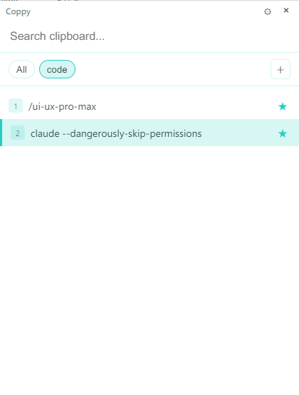
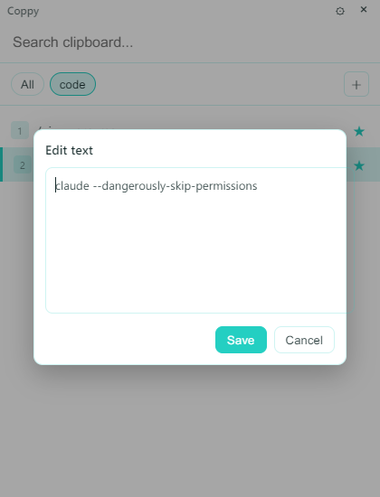
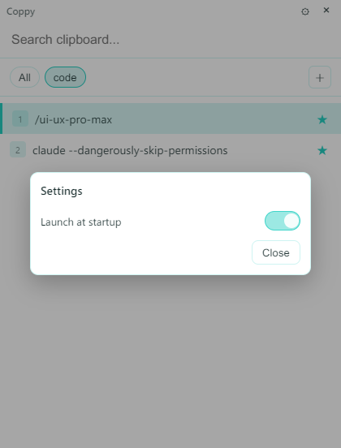
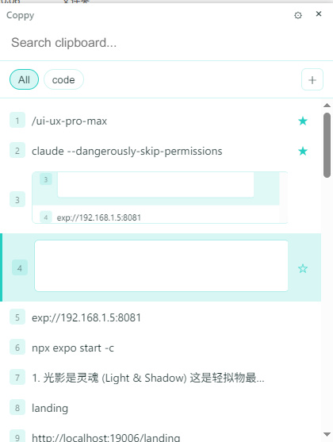
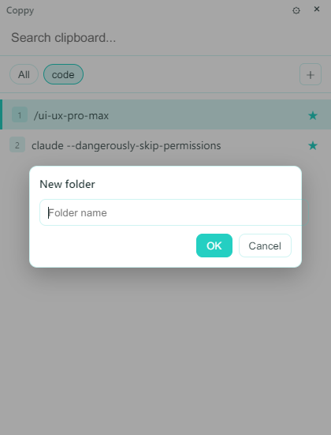

# Coppy 品牌介绍手册（Brand Handbook）

> 核心概念：如呼吸般自然

- 适用范围：产品界面、交互反馈、文案、图标与视觉素材
- 目标读者：产品/设计/研发/运营（任何会“对用户说话”的地方）
- 版本：v0.1（草案）
- 更新日期：2026-01-20

## 目录

- [1. 这份手册怎么用](#1-这份手册怎么用)
- [2. 品牌核心概念（Core Concept）](#2-品牌核心概念core-concept)
- [3. 品牌关键词（Brand Keywords）](#3-品牌关键词brand-keywords)
- [4. 品牌人格化（Brand Persona）](#4-品牌人格化brand-persona)
- [5. 视觉系统（Visual System）](#5-视觉系统visual-system)
- [6. 交互与动效（Interaction & Motion）](#6-交互与动效interaction--motion)
- [7. 文案语调（Tone of Voice）](#7-文案语调tone-of-voice)
- [8. UX 文案模式库（Copy Patterns）](#8-ux-文案模式库copy-patterns)
- [9. 产品触点规范（Product Surfaces）](#9-产品触点规范product-surfaces)
- [10. 标识与图标（Logo & Icon）](#10-标识与图标logo--icon)
- [11. Slogan 与短句（Slogans）](#11-slogan-与短句slogans)
- [12. 发布前自检清单（Ship Checklist）](#12-发布前自检清单ship-checklist)

---

## 1. 这份手册怎么用

Coppy 的品牌不是“做出来给人看”的，而是“用起来就顺”的一套约束。

- 当你要新增一个功能：先对照「核心概念」与「关键词」，确保“更轻、更灵动、更纯净、更可靠”。
- 当你要加一个按钮/提示：先对照「交互与动效」与「文案语调」，确保“轻轻提醒，不打断”。
- 当你要做视觉统一：先对照「视觉系统」，把颜色/字号/圆角/阴影都收敛到同一套。

这份手册只回答三件事：
- Coppy 为什么存在（原则）
- Coppy 看起来应该像什么（系统）
- Coppy 说话/反馈应该怎么说（模式）

---

## 2. 品牌核心概念（Core Concept）

### “如呼吸般自然”

Coppy 的存在不是为了彰显自己，而是为了让“复制/粘贴”这个高频动作变得像呼吸一样自然、顺畅、无感。用户在使用时甚至感觉不到它的存在，但一旦离开它，就会感到不习惯。

这句话落到产品上，有 4 条工作原则：

1) 隐身默认（Invisible by default）
- 不抢注意力：不常驻大窗口、不频繁弹窗、不用大红大绿。
- 反馈要轻：提示短、弱、可忽略，但能被感知。

2) 呼之即来（Instant summon）
- 入口要明确且稳定：快捷键、托盘、固定位置的设置入口。
- 响应要快：点击/快捷键触发后立即可用。

3) 挥之即去（Easy dismiss）
- 退出/关闭行为要“温柔”：更像“收起”而不是“结束/退出”。
- 不让用户为“怎么找回窗口”付出心智成本。

4) 可靠托底（Reliable base）
- 轻量不等于脆弱：记录准确、不丢、可恢复。
- 异常要可理解：失败时解释清楚发生了什么、能怎么做。

示例截图（用于语境参考）：

---

## 3. 品牌关键词（Brand Keywords）

### 轻盈（Airy）

定义：占用小、界面极简、信息密度适中，不把用户当工程师。

产品/界面行为：
- 内容优先：列表是主角，控制项尽量隐身到“必要时才出现”。
- 轻边界：少用重阴影/厚描边/大块色。

避免（Anti-patterns）：
- 把“设置/提示/教程”堆满首屏
- 用强烈的成功弹窗打断操作

### 灵动（Agile）

定义：响应快、跟手、反馈清晰但不吵。

产品/界面行为：
- 快捷键是一等公民：无需鼠标也能完成核心路径。
- 所有按钮都要“像弹簧一样轻”：触发成本低，撤销/收起明确。

避免：
- 任何需要用户等 1 秒以上才有反应的交互
- 交互反馈晚于结果（例如先发生结果后才给提示）

### 纯净（Pure）

定义：不油腻、不推销、不社交；功能克制、权限克制。

产品/界面行为：
- 不引导“必须登录/必须开权限”作为默认姿态。
- 需要权限时解释“为什么需要”和“不给会怎样”，并提供退路。

避免：
- 命令式文案（“立即开启权限！”）
- 过度收集、过度曝光用户隐私

### 可靠（Reliable）

定义：轻，但稳；记录准确，不丢数据。

产品/界面行为：
- 关键动作要有确认/托底：例如写入剪贴板失败也要解释，并保证列表状态一致。
- 错误信息可行动：告诉用户下一步能做什么。

避免：
- “失败了但不说原因”
- 用含糊的“未知错误”当作默认文案

---

## 4. 品牌人格化（Brand Persona）

### 人格设定

如果 Coppy 是一个人：

- 一位穿着白衬衫、话不多但极具眼力见的“整理师”。
- 他总是安安静静地待在角落（托盘区），当你需要一张刚才看过的图片或一段文字时，只需一个眼神（快捷键），他就能立刻递到你手上，然后默默退下。
- 他不油腻，不推销，只专注于效率。

### 设计翻译

- “不喧哗”：少用强情绪词（震撼、强大、惊艳）。
- “很懂事”：把复杂藏起来，把结果递上来。
- “不评价用户”：不说“你应该…”，说“如果需要…我可以…”。

---

## 5. 视觉系统（Visual System）

视觉方向：清风系、留白、克制的青色点缀。

### 5.1 颜色系统（Color Palette）

以中性白与雾灰为底，青色作为“轻提示/轻聚焦”的点缀色。

建议色板（可作为 design tokens）：

| Token | 含义 | Hex | 使用建议 |
|---|---|---:|---|
| `--c-bg` | 主背景 | `#FBFDFD` | 窗口底色，尽量保持干净 |
| `--c-surface` | 卡片/面板 | `#FFFFFF` | 列表项、弹窗内容区 |
| `--c-border` | 边界线 | `#E6EEF0` | 1px 细线，替代重阴影 |
| `--c-text` | 主文字 | `#102A2E` | 标题/正文 |
| `--c-text-muted` | 次级文字 | `#5B6B6E` | 说明、辅助 |
| `--c-accent` | 清风青（主点缀） | `#22C1C3` | 聚焦、选中态、轻提示 |
| `--c-accent-soft` | 清风青（柔光） | `#D6F6F6` | 光晕/背景高亮（少量） |
| `--c-danger` | 温和警示 | `#E55D5D` | 严重错误（尽量不用纯红大片） |
| `--c-warning` | 温和提醒 | `#D39B2A` | 需要注意的非阻断提示 |

用色规则：
- 青色只用来“指向”与“轻反馈”，不要铺满大面积背景。
- 错误色只在必要时出现，且优先用文字解释而不是颜色“吼”。

### 5.2 字体与排版（Typography）

中文优先，读起来要“干净、清晰、不紧张”。

建议字体栈（不强制引入字体文件时的优雅降级）：
- 中文：`"Source Han Sans SC"`, `"Noto Sans SC"`, `"Microsoft YaHei"`, `system-ui`, `sans-serif`
- 英文/数字：`"Source Sans 3"`, `"Inter"`, `system-ui`, `sans-serif`

字号层级（建议）：

| 场景 | 字号/行高 | 字重 | 备注 |
|---|---|---|---|
| 应用标题/主标题 | 16/22 | 600 | 不要大字号压迫 |
| 列表主内容 | 13–14 / 18–20 | 400–500 | 高可读 |
| 辅助信息/时间/提示 | 12 / 16 | 400 | 用 `--c-text-muted` |
| 弹窗标题 | 14–16 / 20–22 | 600 | 克制但明确 |

排版规则：
- 少用全大写；少用连续感叹号。
- 数字/快捷键展示用等宽或半等宽更稳定（如 `Ctrl+V`）。

### 5.3 留白与间距（Spacing）

用 4/8 基准网格：
- 基准：4px
- 常用：8 / 12 / 16 / 20 / 24

布局建议：
- 窗口内边距：16–20
- 列表项内边距：12–16
- 按钮之间间距：8

密度策略：
- 默认密度偏“舒适”，不要做成“信息墙”。
- 当内容变多时，优先优化滚动/筛选，而不是压缩到拥挤。

### 5.4 圆角（Radii）

核心规则：拒绝尖锐直角。

- 小组件（按钮、标签、输入框）：8px
- 卡片/列表项/弹窗：12px

### 5.5 组件风格（Components）

通用视觉要点：
- 边界优先：用 `1px` 边线和轻阴影代替厚重阴影。
- 交互态优先：hover/active/focus 都要“轻轻变化”。

组件建议（不限定实现方式）：

1) 列表项（List Item）
- 默认：白底 + 细边界
- Hover：边界更明显或背景轻微变亮
- Selected：用清风青的“细线/浅底色”表示，不要整块强色

2) 弹窗（Modal）
- 背景遮罩弱一点，强调“不是警报，是临时停靠”。

示例截图：

3) Toast/轻提示
- 小、短、可忽略
- 文案一句话即可，必要时补一条“怎么做”

4) Tab/文件夹
- 使用清风青作为当前态指示；其余保持干净

示例截图：

---

## 6. 交互与动效（Interaction & Motion）

动效的目标不是“好看”，而是“更像呼吸”。

### 6.1 动效原则

- 轻：时长短，幅度小
- 准：只给有意义的反馈（成功/失败/聚焦/状态切换）
- 可忽略：用户不看也不妨碍完成任务

### 6.2 推荐时长与曲线

| 场景 | 时长 | 缓动 | 备注 |
|---|---:|---|---|
| hover/focus | 120–160ms | ease-out | 轻快，跟手 |
| modal 进出 | 160–220ms | cubic-bezier(0.2, 0.8, 0.2, 1) | 像“靠近/退开” |
| toast 出现 | 140–180ms | ease-out | 不抢戏 |
| 列表滚动阻尼 | 交互驱动 | - | “像水流” |

可访问性：
- 尊重系统的减少动效设置（prefers-reduced-motion），必要时降级为无动效。

### 6.3 微交互（Micro-interactions）

复制成功/写入成功：
- 不用大弹窗。
- 用轻轻的青色光晕或极小的气泡提示（1000–1500ms 自动消失）。

滚动：
- 如水流般顺滑，带有轻微阻尼感。

编辑文本：
- 键盘优先：`Ctrl+Enter` 保存，`Esc` 关闭；不打断输入。

示例截图：

---

## 7. 文案语调（Tone of Voice）

目标：人话、克制、温和。

### 7.1 原则

- 先共情，再解释，再给路
- 不命令，不吓唬，不“教育用户”
- 失败要说清楚，但不要甩锅

### 7.2 Do / Don’t

| 场景 | Don’t（机械/命令式） | Do（对话/建议式） |
|---|---|---|
| 错误 | 错误：无法复制。 | 哎呀，刚才好像没写进剪贴板。 |
| 权限 | 立即开启权限！ | Coppy 需要一点权限才能帮您记录哦。 |
| 宣传 | 震撼发布！功能极其强大！ | 简单的复制，也可以很美好。 |

### 7.3 词汇偏好

建议多用：
- “好像…” “需要一点…” “要不要试试…” “我来帮您…”

尽量少用：
- “必须/立刻/强烈建议/严重/致命”

---

## 8. UX 文案模式库（Copy Patterns）

以下模板优先中文，英文作为可选对照。括号里的内容可按场景替换。

### 8.1 成功提示（非打断）

- 中文：已复制到剪贴板。
- 中文（更轻）：好了。
- 英文：Copied.

规则：
- 1 句话够用，不要解释太多。
- 能不出现就不出现；出现也要短、轻、快消失。

### 8.2 失败提示（可行动）

- 中文：刚才没写进剪贴板（列表已更新）。要不要再试一次？
- 英文：Couldn’t write to clipboard (list updated). Try again?

规则：
- 明确“发生了什么” + “你能怎么做”。
- 不要把错误码直接甩给用户。

### 8.3 空状态

- 中文：这里还没有记录。复制一段文字或图片，Coppy 会轻轻记下来。
- 英文：Nothing here yet. Copy something and Coppy will keep it.

### 8.4 权限提示

- 中文：Coppy 需要一点权限才能帮您记录剪贴板内容。您也可以先继续使用基础功能。
- 英文：Coppy needs a permission to read clipboard. You can keep using basic features.

### 8.5 设置项开关（例如开机自启）

- 打开成功：已开启开机自启。
- 关闭成功：已关闭开机自启。
- 失败：开机自启设置没有生效。要不要再试一次？

示例截图：

### 8.6 编辑文本

- 标题：编辑文本
- 辅助说明（可选）：`Ctrl+Enter` 保存，`Esc` 关闭
- 保存成功：已更新。
- 保存失败（剪贴板写入失败）：刚才没写进剪贴板（内容已在列表里更新）。

---

## 9. 产品触点规范（Product Surfaces）

### 9.1 托盘（Tray）

目标：让用户永远能“找回 Coppy”，并且操作不打断。

建议：
- 菜单项命名短、直观：`显示/隐藏`、`退出`
- 退出前避免“确认弹窗”打断；除非有明确风险（例如后台任务）

文案风格：
- “显示 Coppy” 比 “打开主窗口” 更像人话

### 9.2 主界面（剪贴板历史）

目标：快速定位刚才那条内容，并完成粘贴。

建议：
- 列表项信息层级清晰：主内容 > 次信息（时间/来源）
- 操作按钮在 hover 时出现（减少视觉噪音）

示例截图：

（也可参考 README 截图）

### 9.3 收藏夹 / 文件夹

目标：把“常用内容”整理出来，但不让整理成本反客为主。

建议：
- 创建/切换文件夹动作要轻
- 文件夹为空时给轻提示，不做强引导

示例截图：

### 9.4 弹窗（Modal）

目标：短暂停靠，不制造压力。

建议：
- 标题一句话说明“你正在做什么”
- 主要按钮文案用动词，但克制：`创建`、`保存`、`完成`
- 次要按钮：`取消`

示例截图：

---

## 10. 标识与图标（Logo & Icon）

标识风格：干净、轻、像一口清风。

示例（应用图标/Logo）：

使用规范：
- 清晰边界：避免把 Logo 放在过于复杂的背景上
- 留白：Logo 周围保留至少 1 倍图标内主形状厚度的安全距离
- 最小尺寸：
  - 图标：16px 仍应可辨识轮廓
  - 文档展示：建议 64px 以上

不要：
- 在 Logo 上加投影、描边、渐变“强化存在感”
- 把 Logo 当作按钮使用（按钮请用统一的组件风格）

---

## 11. Slogan 与短句（Slogans）

主打无感：
- 中文：Coppy，轻若无物，如影随形。
- 英文：Coppy: Simply lighter.

同调性备选（可选）：
- 中文：轻轻一呼，便在手边。
- 中文：让复制变得更像本能。
- 英文：Light, quiet, always there.

规则：
- 一句话说完
- 不自夸，不堆形容词

---

## 12. 发布前自检清单（Ship Checklist）

视觉：
- [ ] 大面积背景保持干净（白/雾灰为主）
- [ ] 清风青只用于聚焦/反馈（不铺满）
- [ ] 圆角统一（8/12），没有尖角混入
- [ ] 边界线/阴影克制，不做厚重投影

交互：
- [ ] 反馈不打断（toast/微光晕而非弹窗）
- [ ] 关键路径键盘可用（打开/选择/粘贴/关闭）
- [ ] 关闭/隐藏行为不让用户“找不到窗口”

文案：
- [ ] 不命令、不吓唬、不教育用户
- [ ] 失败信息可行动（告诉用户下一步怎么做）
- [ ] 不出现“震撼/强大/致命”等强情绪词
